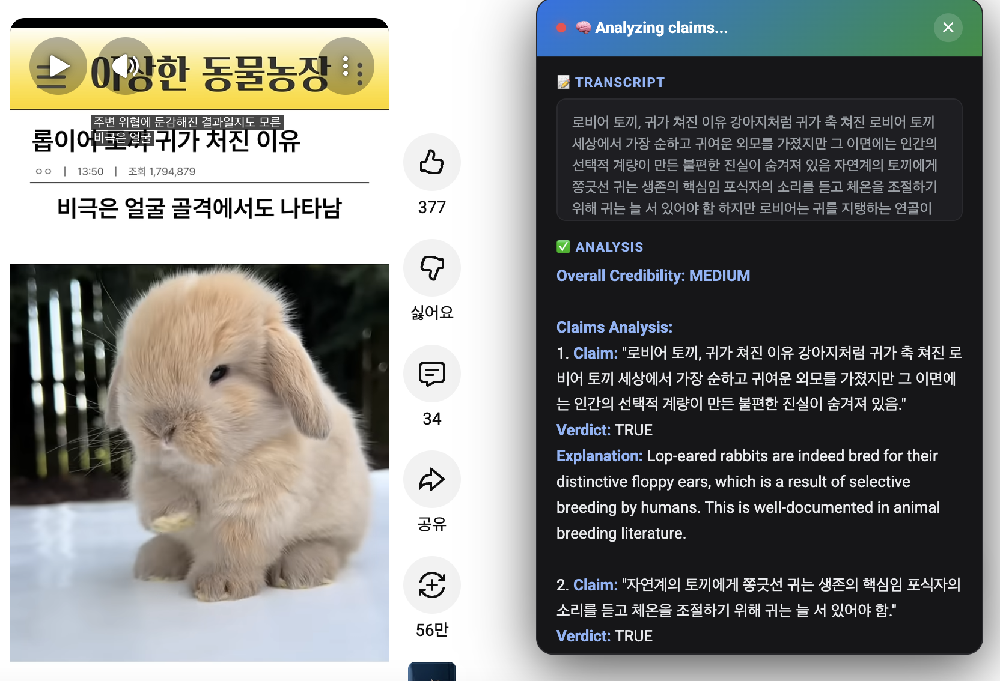

# 🔍 YouTube Shorts Fact Checker



AI-powered Chrome extension that fact-checks YouTube Shorts using OpenAI's Whisper (transcription) and GPT-5.2 (analysis).

## How It Works

1. **Detect** — Content script detects when you're on a YouTube Short
2. **Extract** — Captures audio from the video using `captureStream` + `MediaRecorder`
3. **Transcribe** — Sends audio to OpenAI Whisper API for speech-to-text
4. **Analyze** — Sends transcript to GPT-5.2 for fact-checking
5. **Display** — Shows results in an overlay with claims, verdicts, and sources

## Installation

1. Clone or download this repository
2. Open Chrome and go to `chrome://extensions/`
3. Enable **Developer mode** (top right toggle)
4. Click **Load unpacked** and select the `yt-shorts-factcheck` folder
5. Click the extension icon → **Configure API Key**
6. Enter your [OpenAI API key](https://platform.openai.com/api-keys)

## Usage

1. Navigate to any YouTube Short (e.g., `youtube.com/shorts/...`)
2. A **🔍 Fact Check** button appears in the bottom-right corner
3. Click it to start the analysis
4. Wait for transcription + fact-checking (10-30 seconds)
5. Review the results overlay with:
   - **Transcript** of the video
   - **Claims analysis** with TRUE/FALSE/MISLEADING verdicts
   - **Overall credibility rating**
   - **Suggested sources** for verification

## Architecture

```
yt-shorts-factcheck/
├── manifest.json      # Extension manifest (MV3)
├── background.js      # Service worker — OpenAI API calls
├── content.js         # Content script — audio extraction + UI
├── content.css        # Overlay + button styles
├── popup.html/js      # Extension popup
├── options.html/js    # API key configuration
└── icons/             # Extension icons
```

## API Costs

- **Whisper**: ~$0.006/minute of audio (Shorts are ≤60s)
- **GPT-5.2**: ~$0.01-0.03 per fact-check

Each fact-check costs roughly **$0.01-0.04**.

## Notes

- Audio extraction uses `HTMLVideoElement.captureStream()` which requires Chrome
- If audio extraction fails (e.g., DRM), the extension falls back to metadata-only analysis
- Your API key is stored locally via `chrome.storage.sync` and never sent anywhere except OpenAI
- Replace the placeholder icon PNGs with real icons before publishing

## Requirements

- Chrome 110+
- OpenAI API key with access to Whisper and GPT-5.2
